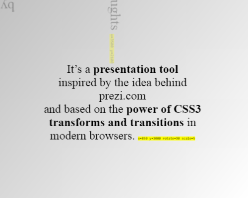

# impress.js - Slide Show (S9) Template Pack

## Live Preview



See [`slides.html`](http://slideshow-templates.github.io/slideshow-impress.js/slides.html).

## What's Slide Show (S9)?

A Ruby gem that lets you create slide shows and author slides in plain text
using a wiki-style markup language that's easy-to-write and easy-to-read.
More [Slide Show (S9) Project Site »](http://slideshow-s9.github.io)

## Intro

The [impress.js](https://github.com/impress/impress.js) package by Bartek Szopka (aka bartaz)
bundled up into a Slide Show (S9) template pack
lets you author your slides
in a wiki-style markup language (that is, Markdown) plus
lets you use text filters and helpers for adding comments, macros,
includes, syntax highlighters and much more.

Note, the package is configured to use the following headers in `slides.html`:

    author: Your Name Here
    title: Your Slide Show Title Here
 

## Try It Yourself - How To Use the impress.js Template Pack

If you want to try it yourself, install (fetch) the new template pack. Issue the command:

    $ slideshow install impress.js

Or as an alternative clone the template pack using `git`. Issue the commands:

    $ cd ~/.slideshow/templates
    $ git clone https://github.com/slideshow-templates/slideshow-impress.js.git

To check if the new template got installed, use the `list` command:

    $ slideshow list

Listing something like:

    Installed templates include:
       impress.js (~/.slideshow/templates/impress.js/impress.js.txt)

Tip: To get started use the included quick starter sample. Issue the command:

    $ slideshow new -t impress.js

Now you will have a copy of the impress.js Quick Starter sample
(that is, [`impress.js.text`](https://raw.github.com/slideshow-s9/slideshow-impress.js/master/sample.md)
and [`impress2.js.text`](https://raw.github.com/slideshow-s9/slideshow-impress.js/master/sample2.md))
in Markdown in your working folder.

```
title: impress.js | the power of CSS3 transforms and transitions
author: Bartek Szopka


!SLIDE slide x=-1000 y=-1500

Aren't you just **bored** with all those slides-based presentations?


!SLIDE slide x=0 y=-1500

Don't you think that presentations given **in modern browsers**
shouldn't **copy the limits** of 'classic' slide decks?


!SLIDE slide x=1000 y=-1500

Would you like to **impress your audience**
with **stunning visualization** of your talk?


!SLIDE x=0 y=0 scale=4

then you should try  
impress.js<sup>*</sup>  
<sup>*</sup>no rhyme intended


!SLIDE x=850 y=3000 rotate=90 scale=5

It's a **presentation tool**  
inspired by the idea behind [prezi.com](http://prezi.com)  
and based on the **power of CSS3 transforms and transitions** in modern browsers.


!SLIDE x=3500 y=2100 rotate=180 scale=6

visualize your **big** thoughts


!SLIDE x=2825 y=2325 z=-3000 rotate=300 scale=1

and **tiny** ideas


!SLIDE x=3500 y=-850 rotate=270 scale=6

by **positioning**, **rotating** and **scaling** them on an infinite canvas


!SLIDE x=6700 y=-300 scale=6

the only **limit** is your **imagination**


!SLIDE x=6300 y=2000 rotate=20 scale=4

want to know more?
[use the source](http://github.com/impress/impress.js), Luke!
```

Showtime! Let's use the `-t/--template` switch to build the
sample slide show. Example:

    $ slideshow build impress.js.text -t impress.js

Open up the generated `impress.js.html` page in your browser. Voila. That's it.


## Questions? Comments?

Questions? Comments?
Send them along to the [wwwmake forum/mailing list](http://groups.google.com/group/wwwmake).
Thanks!

